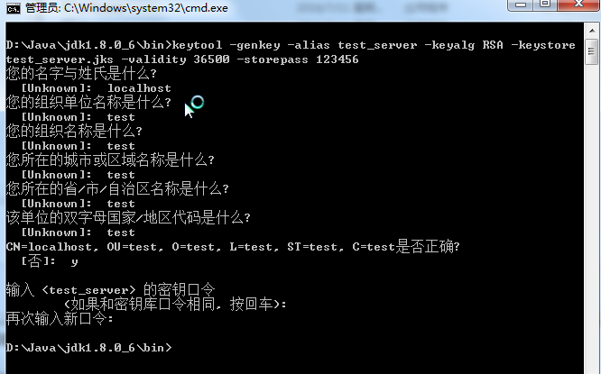
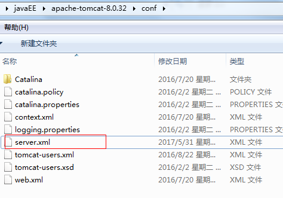
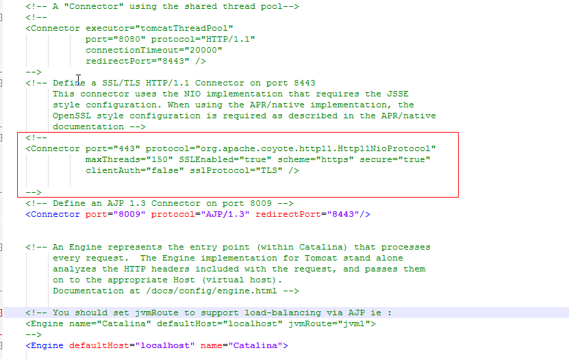
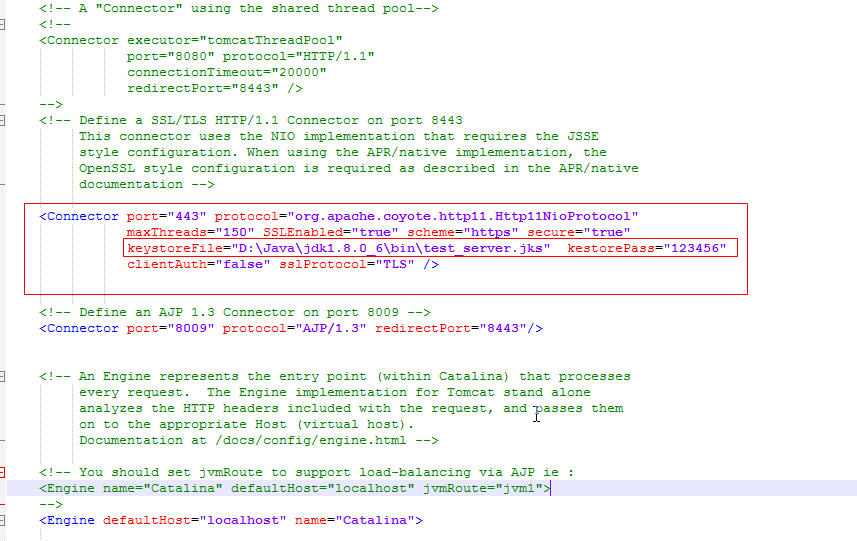
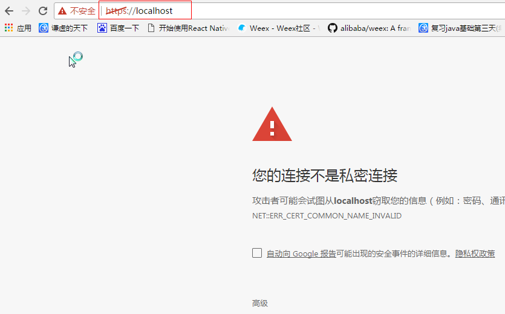

# Tomcat服务器搭建Https协议

## 什么是Http协议？

HTTP是[hypertext transfer protocol（超文本传输协议）]()的简写，它是TCP/IP协议之上的一个应用层协议，用于定义WEB浏览器与WEB服务器之间交换数据的过程以及数据本身的格式

WEB[浏览器]()与WEB[服务器]()之间的一问一答的交互过程必须遵循一定的[规则]()，  这个规则就是HTTP协议.

## 什么是Https协议？

HTTPS（全称：[Hyper Text Transfer Protocol over Secure Socket Layer]()），是以安全为目标的[HTTP](http://baike.baidu.com/item/HTTP)通道，简单讲是[HTTP的安全版]()。即HTTP下加入SSL层，HTTPS的安全基础是[SSL]()，因此加密的详细内容就需要SSL。HTTPS不同于HTTP：默认[端口](http://baike.baidu.com/item/%E7%AB%AF%E5%8F%A3)及一个加密/身份验证层（在HTTP与TCP之间）。

## Tomcat服务器搭建Https协议

### 1.生成安全证书

生成服务器端证书：

打开cmd命令行，进入到jdk的bin目录下执行下面的指令，然后会在当前目录生成相应的服务器端证书

```
keytool -genkey -alias test_server -keyalg RSA -keystore test_server.jks -validity 36500 -storepass 123456


参数简要说明：

“test_server.jks” 含义是将证书文件的保存路径，

证书文件名称是 “test_server.jks”，

“-validity 36500”含义是证书有效期，36500表示100年，默认值是90天 

“test_server”为自定义证书名称
```

如图：



```
在命令行参数说明：
1.“您的名字与姓氏是什么？”这是必填项，并且必须是TOMCAT部署主机的域名或者IP（就是你将来要在浏览器中输入的访问地址），否则浏览器会弹出警告窗口，提示用户证书与所在域不匹配。在本地做开发测试时，应填入“localhost”。
2.“你的组织单位名称是什么？”、“您的组织名称是什么？”、“您所在城市或区域名称是什么？”、“您所在的省、市、自治区名称是什么？”、“该单位的双字母国家、地区代码是什么？” 可以按照需要填写也可以不填写直接回车，在系统询问“正确吗？”时，对照输入信息，如果符合要求则使用键盘输入字母“y”，否则输入“n”重新填写上面的信息。
3.输入<test_server>的密钥口令：此处需要输入大于6个字符的字符串。
4.再次输入<test_server>的口令主，这项较为重要，会在tomcat配置文件中使用，建议输入与test_server.jsk的密码一致，设置其它密码也可以，完成上述输入后，直接回车.
```

### 2.配置tomcat

定位到tomcat服务器的安装目录, 找到conf下的server.xml文件



找到server.xml文件中如下已经被注释的代码：



去掉框中代码的注释，修改成下面



```
参数说明：
keystoreFile="D:\Java\jdk1.8.0_6\bin\test_server.jks"   服务器端证书的路径
kestorePass="123456"  服务器端证书的密钥
prot="443" https的默认端口是443, 这里将端口8443改为了443
```

### 3检验配置

启动tomcat服务器，

**在浏览器中输入: https://localhost**,  提示图下代表tomcat配置https协议成功




### 

