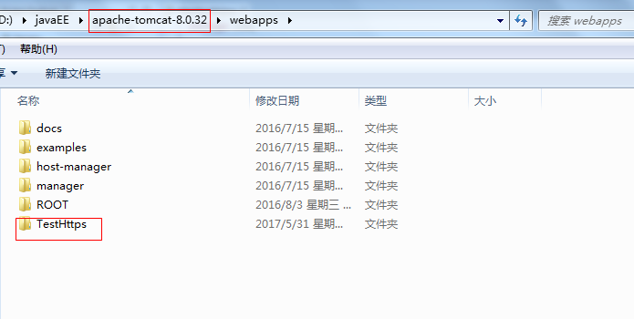
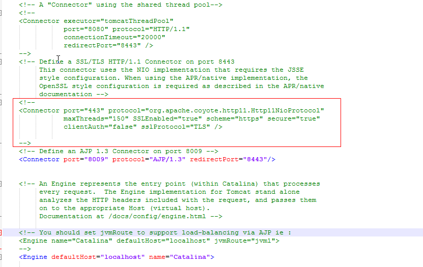
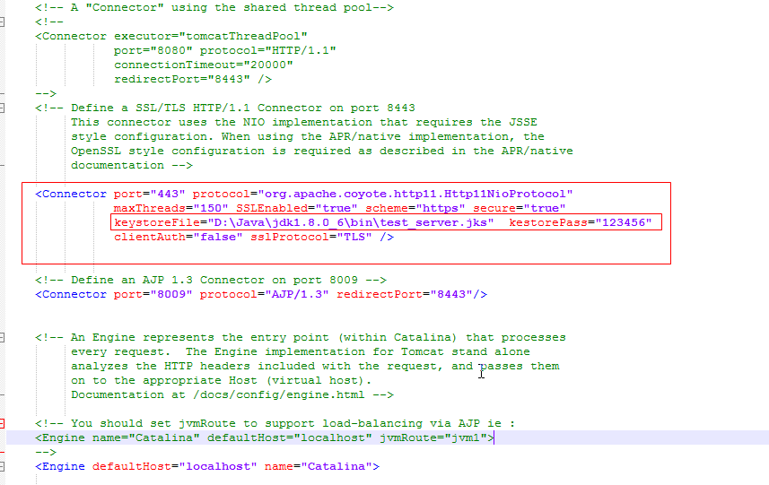

# Android访问Https协议的接口

为了演示Android端要访问一个基于Https协议的接口，下面教大家如何快速的开发一个Servlet接口

## 1.开发一个基于Https协议接口

1.在eclipse中新建一个动态web项目，如下图：


2.新建一个HttpsTest项目。这是一个javaweb项目


3.开发一个Servlet接口, 直接向客户端返回一个字符串.


其中@WebServlet（“/test”）是提高给外部访问的路径，例如上面接口提供给外部访问的路径是：

http:// IP 地址 : 端口 /HttpsTest/test  [ 或者]()  https : // IP 地址 : 端口 /HttpsTest/test 


4.将该项目发布在的tomcat中。发布的过程自行百度。




5.测试项目是否部署成功。可以直接访问开发好的接口。出现下面hello https代表接口开发完毕并且并部署完毕。下面访问的接口使用的协议还是http，那么如何实现访问该接口使用https协议呢？解决方案：tomcat配置支持使用Https协议，配置好tomat之后就可以直接使用https协议访问该接口。


6.tomcat配置支持使用Https协议

定位到tomcat服务器的安装目录, 找到conf下的server.xml文件


找到server.xml文件中如下已经被注释的代码：



去掉框中代码的注释，修改成下面



```
参数说明：
keystoreFile="D:\Java\jdk1.8.0_6\bin\test_server.jks"   服务器端证书的路径
kestorePass="123456"  服务器端证书的密钥
prot="443" https的默认端口是443, 这里将端口8443改为了443
```

7.重新启动Tomcat。这时可以使用Https协议访问上面开发好的接口。提示该接口不安全，因为缺少证书


## 2.客户端证书生成

服务器端开发的接口使用了Https协议，那么Android端在使用https协议访问服务器时必须先要添加证书验证。那么Android端的证书怎么获取呢？这里可以根据服务器端的证书来生成客户端的证书。例如，服务器端的证书是test_server.jks， 那么就可以通过test_server.jks生成客户端证书test_server.cer。生成步骤看下面指令：

打开cmd命令行，进入到jdk的bin目录下执行下面的指令，然后会在当前目录生成相应的客户端证书（test_server.cer）

```
keytool -export -alias test_server -file test_server.cer -keystore test_server.jks -storepass 123456

参数说明：
“test_server.cer” 客户端证书保存的路劲，这里保存在当前路径下
“test_server.jks” 服务器端证书路劲，这里是在当前文件夹下（客户端证书的生成依赖服务器端的证书）
“123456” 服务器端证书密钥
```

如图：


## 3.Android端添加证书

1.新建一个Android项目 

2.引入OKHttp框架


3.访问上面开发好的https://xxxx:xxxx/TestHttps/test接口

访问接口的代码


请求返回的结果：

因为接口使用了https的协议，Android端没有添加相应的证书，所以请求结果报如下错


4.添加证书


添加证书的方法setCertificates具体的逻辑：

```
 public void setCertificates(InputStream... certificates)
    {
        try
        {
            CertificateFactory certificateFactory = CertificateFactory.getInstance("X.509");
            KeyStore keyStore = KeyStore.getInstance(KeyStore.getDefaultType());
            keyStore.load(null);
            int index = 0;
            for (InputStream certificate : certificates)
            {
                String certificateAlias = Integer.toString(index++);
                keyStore.setCertificateEntry(certificateAlias, certificateFactory.generateCertificate(certificate));
                try
                {
                    if (certificate != null)
                        certificate.close();
                } catch (IOException e)
                {
                }
            }
            SSLContext sslContext = SSLContext.getInstance("TLS");
            TrustManagerFactory trustManagerFactory =
                    TrustManagerFactory.getInstance(TrustManagerFactory.getDefaultAlgorithm());
            trustManagerFactory.init(keyStore);
            sslContext.init
                    (
                            null,
                            trustManagerFactory.getTrustManagers(),
                            new SecureRandom()
                    );
            //给okHttpClient添加证书        
            okHttpClient.setSslSocketFactory(sslContext.getSocketFactory());
            okHttpClient.setHostnameVerifier(new HostnameVerifier() {
                @Override
                public boolean verify(String hostname, SSLSession session) {
                    return true;
                }
            });
        } catch (Exception e)
        {
            e.printStackTrace();
        }

    }
```

添加证书后Android 再次发送请求，能获取到服务器返回的结果，证明Android端添加证书成功。


